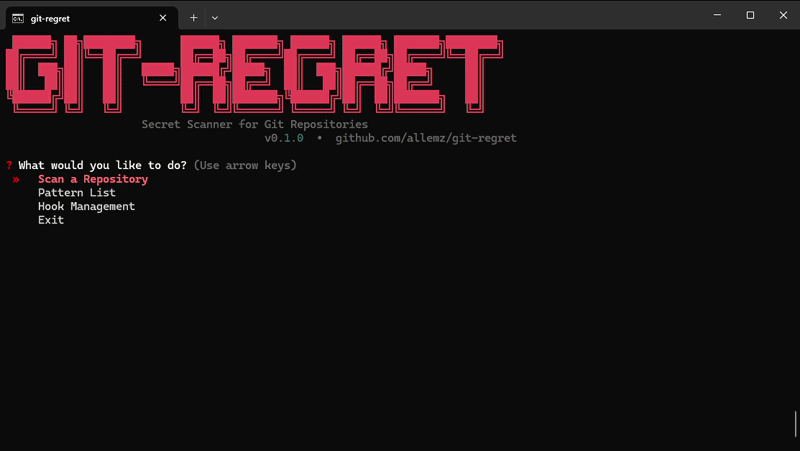

<div align="center">

```
 ██████╗ ██╗████████╗      ██████╗ ███████╗ ██████╗ ██████╗ ███████╗████████╗
██╔════╝ ██║╚══██╔══╝      ██╔══██╗██╔════╝██╔════╝ ██╔══██╗██╔════╝╚══██╔══╝
██║  ███╗██║   ██║   █████╗██████╔╝█████╗  ██║  ███╗██████╔╝█████╗     ██║   
██║   ██║██║   ██║   ╚════╝██╔══██╗██╔══╝  ██║   ██║██╔══██╗██╔══╝     ██║   
╚██████╔╝██║   ██║         ██║  ██║███████╗╚██████╔╝██║  ██║███████╗   ██║   
 ╚═════╝ ╚═╝   ╚═╝         ╚═╝  ╚═╝╚══════╝ ╚═════╝ ╚═╝  ╚═╝╚══════╝   ╚═╝
```

**Secret Scanner for Git Repositories**

Find API keys, tokens, passwords and sensitive data hiding in your git history — before someone else does.

[](https://python.org)
[](LICENSE)
[](#what-it-detects)
[]()
[](https://pypi.org/project/git-regret-tool)
[](https://pypi.org/project/git-regret-tool)
[](https://github.com/allemz/git-regret)
[](https://github.com/allemz/git-regret/issues)

</div>

---

## 🤔 Why git-regret?

You committed an API key six months ago. You deleted it in the next commit. You think you're safe.

**You're not.**

Anyone who clones your repo can see that key in the git history. `git-regret` scans every commit, every file, every line — and tells you exactly what needs to go.

---

## ✨ Features

- 🔍 **132 built-in patterns** — AWS, OpenAI, Stripe, GitHub, Discord, Telegram, database URLs, private keys, and more
- 🕰️ **Full history scan** — not just current files, every commit ever made
- 🔗 **Scan any GitHub URL** — paste a repo URL and it clones, scans, and cleans up automatically
- 🧠 **Entropy analysis** — catches high-entropy strings that look like secrets even without a known pattern
- 🧹 **Auto clean** — removes secrets from git history using `git-filter-repo`
- 🔒 **Pre-commit hook** — never accidentally commit a secret again
- 🖥️ **Interactive TUI** — beautiful menu-driven interface, no flags to memorize
- 📄 **JSON reports** — pipe results into your CI/CD pipeline

---

<div align="center">
  
</div>

## 🚀 Quick Start

### Windows (Double-click)

1. Download and extract the zip
2. Double-click `start.bat`
3. Done — it installs everything and opens the interactive menu

### Manual Install

```bash
git clone https://github.com/allemz/git-regret
cd git-regret
pip install -e .
```

---

## 🖥️ Usage

### Interactive Menu (Recommended)

```bash
git-regret-ui
```

Navigate with arrow keys, select with Enter. No flags to memorize.

### Command Line

```bash
# Scan current directory
git-regret scan

# Scan including full git history
git-regret scan --history

# Scan a specific path
git-regret scan --path /path/to/repo

# Export results as JSON
git-regret scan --history --output report.json

# Use in CI (exits with code 1 if findings exist)
git-regret scan --history --fail-on-findings

# Clean secrets from git history
git-regret clean

# Install pre-commit hook
git-regret protect install

# List all patterns
git-regret patterns
git-regret patterns --tag aws
```

### Scan a GitHub Repository

No need to clone manually — just paste the URL in the TUI or use:

```bash
# In the interactive menu:
# > Scan a Repository > GitHub / Git URL > https://github.com/user/repo
```

---

## 🎯 What It Detects

| Category | Examples |
|---|---|
| ☁️ **Cloud** | AWS Access Keys, GCP Service Accounts, Azure Connection Strings |
| 🤖 **AI Services** | OpenAI, Anthropic, HuggingFace, Replicate |
| 💳 **Payments** | Stripe, PayPal, Braintree, Square, Iyzico, PayTR |
| 💬 **Social** | Discord, Slack, Telegram, Twitter, Facebook |
| 🗄️ **Databases** | MongoDB, PostgreSQL, MySQL, Redis, Supabase, Neon |
| 🔐 **Crypto** | RSA/EC/SSH private keys, PGP blocks |
| 📧 **Comms** | SendGrid, Mailgun, Mailchimp, Twilio |
| 🕵️ **PII** | Turkish TC No, IBAN, Credit Cards, SSN |
| 🔑 **Generic** | Hardcoded passwords, tokens, API keys |
| 🧠 **Entropy** | Any high-entropy string that looks like a secret |

132 patterns total. [See full list →](git_regret/patterns/definitions.py)

---

## 📊 Example Output

```
╭───────────────────────────────╮
│ 🔍 git-regret Secret Scanner  │
╰───────────────────────────────╯
Repo: /home/user/my-project
Git history: 47 commits scanned
Files: 312 files scanned

⚠️  3 issue(s) found!!

╭──────────┬──────────────────────┬──────────────┬───────┬─────────╮
│ Severity │ Type                 │ File         │ Line  │ Commit  │
├──────────┼──────────────────────┼──────────────┼───────┼─────────┤
│ CRITICAL │ AWS Access Key ID    │ config.py    │ 12    │ a3f9d12 │
│ CRITICAL │ OpenAI API Key       │ .env         │ 3     │ working │
│ HIGH     │ Stripe Webhook Secret│ webhook.py   │ 8     │ b7c2e45 │
╰──────────┴──────────────────────┴──────────────┴───────┴─────────╯

critical: 2  high: 1
```

---

## 🔒 Pre-commit Hook

Install once, protected forever:

```bash
git-regret protect install
```

Every commit will be automatically scanned. If a secret is detected, the commit is blocked:

```
🔍 git-regret: Scanning staged files...
❌ git-regret: A secret has been detected! Commit canceled.
   Fix the issue and try again.
```

---

## 🧹 Cleaning History

```bash
git-regret clean
```

This uses `git-filter-repo` to permanently rewrite history and remove the sensitive files. **This rewrites git history** — coordinate with your team before running on shared repos.

> ⚠️ After cleaning, force-push and have all collaborators re-clone.

---

## 🏗️ Project Structure

```
git_regret/
├── cli.py              # Click commands
├── tui.py              # Interactive menu (questionary + rich)
├── core/
│   ├── scanner.py      # Scan engine
│   ├── cleaner.py      # git-filter-repo wrapper
│   └── hooks.py        # Pre-commit hook manager
├── models/
│   ├── pattern.py      # Pattern + Severity enum
│   ├── finding.py      # Finding dataclass
│   └── report.py       # Report aggregator
├── patterns/
│   ├── definitions.py  # All 132 pattern definitions
│   └── registry.py     # Pattern registry (singleton)
├── output/
│   ├── formatter.py    # Rich terminal output
│   └── reporter.py     # JSON reporter
└── utils/
    ├── entropy.py      # Shannon entropy analysis
    └── git.py          # GitRepo helper
```

---

## 🤝 Contributing

New pattern ideas, bug fixes, and improvements are welcome.

To add a pattern, open `git_regret/patterns/definitions.py` and add a new entry to `RAW_PATTERNS`:

```python
{
    "id": "my_service_api_key",
    "regex": r"myservice_[0-9a-zA-Z]{32}",
    "description": "MyService API Key",
    "severity": "critical",
    "tags": ["myservice"],
},
```

---

## 📄 License

GNU GPL v3.0 - Use it, modify it, and improve it, but always keep it open source.

---

<div align="center">
<sub>Everyone has committed a secret at least once.</sub>
</div>
